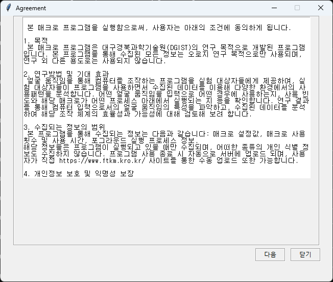
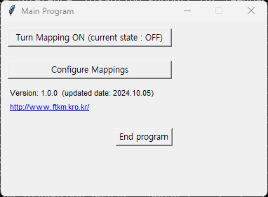
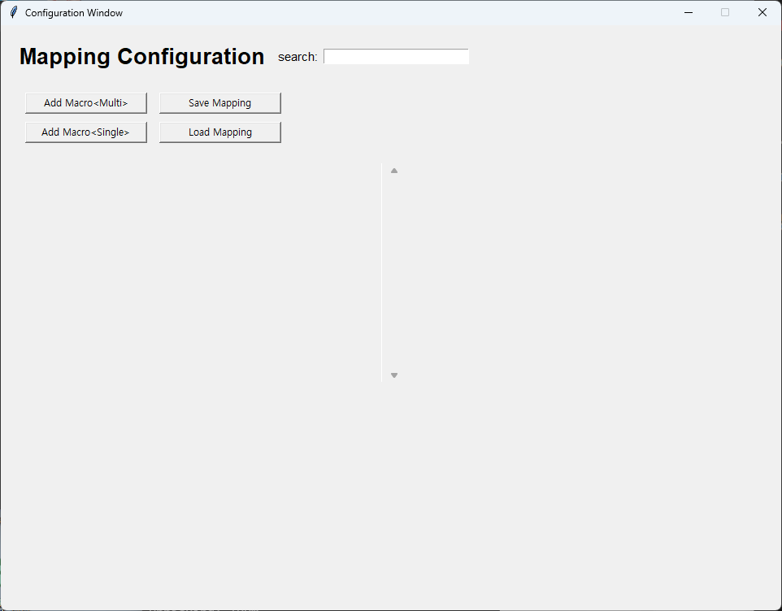
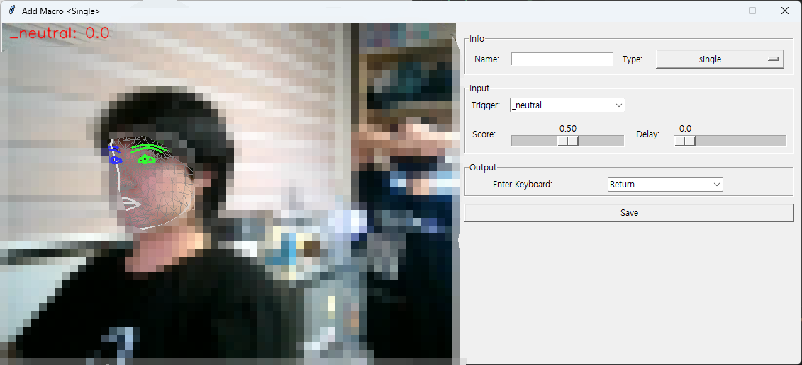

# face_to_keyboard_mouse

🚀 **얼굴 움직임으로 더 자유로운 컴퓨터 사용** 🚀

**face_to_keyboard_mouse**를 통해 얼굴의 다양한 움직임을 보조적인 입력 방식으로 활용해보세요. 입의 움직임, 눈 깜빡임, 고개 돌림 등 얼굴 표정을 자유롭게 설정하여 컴퓨터 조작의 가능성을 열어드립니다.

## 🎮 face_to_keyboard_mouse

- **얼굴을 통한 보조 입력:** 키보드, 마우스와 함께 입과 눈, 얼굴의 움직임을 추가 입력 방식으로 활용할 수 있습니다.
- **정교한 제어:** 눈 깜빡임으로 클릭하고, 고개 돌림으로 화면 전환하는 등, 더욱 세밀하고 직관적인 조작이 가능합니다.
- **다양한 활용 가능성:** 게임에서 조작 방법을 추가하거나, 창작 작업에서 도구를 전환하는 등 활용 범위는 무궁무진합니다.
- **사용자 맞춤 설정:** 얼굴의 움직임을 원하는 키보드 명령어 또는 마우스 동작에 자유롭게 매핑할 수 있습니다.

## 💻 작동 방식

1. 웹캠을 통해 얼굴의 움직임(입, 눈, 머리 등)을 실시간으로 추적합니다.
2. 움직임을 원하는 키보드 또는 마우스 입력에 연결하여 효율적인 컴퓨터 사용이 가능합니다.
3. 설정을 자신만의 방식으로 최적화하여, 작업에 딱 맞는 환경을 만들어보세요.

## 📥 배포

프로그램은 아래 링크에서 다운로드할 수 있습니다:  
[다운로드 링크](https://drive.google.com/file/d/1AXpLALdeciaxrsHTqraHOV8cLPUloUSq/view?usp=sharing)

## 🛠 사용법

face_to_keyboard_mouse은 웹캠을 이용해 얼굴의 다양한 움직임을 추적하여 컴퓨터 입력으로 변환하는 혁신적인 프로그램입니다. :

[>> 프로그램 사용 영상 예시 <<](https://youtu.be/lVHixxnxxb8)

1. 프로그램을 다운로드한 후, 압축을 풀고 파일을 실행하여 프로그램을 실행합니다.  
2. 프로그램을 실행하고 약관을 읽습니다.  
  
3. Configure mapping을 눌러 매핑창으로 이동합니다.  
  
4. Add Macro를 통해 매크로 할당 창으로 이동합니다.  
  
5. 창으로 이동하면 웹캠이 자동으로 연결되며, 사용자의 얼굴을 인식하기 시작합니다.  
  
6. 설정 화면에서 얼굴의 특정 움직임을 원하는 키보드 또는 마우스 입력에 연결할 수 있습니다.  
   - 예: 왼쪽 눈 깜빡임을 'Spacebar'에 매핑, 고개 돌림을 'Backspace'에 매핑.  
7. 사용자 맞춤 설정을 완료하고, Turn Mapping On을 눌러 자유롭게 사용해보세요.  
   

## 🔍 로그 수집 관련 사항

**face_to_keyboard_mouse**은 실험적 목적으로 제작되었으며, 사용 중에 발생하는 로그 데이터를 수집할 수 있습니다.

### 로그 수집 목적
- 프로그램의 성능 분석 및 개선을 위한 데이터 수집.
<!-- - 사용자 피드백을 통해 사용자 경험을 최적화. -->

### 로그 수집 내용
- 얼굴 움직임 인식 데이터.
- 프로그램 사용 중 발생하는 에러 및 성능 정보.

### 사용자의 동의
- 프로그램 사용 시 로그 데이터 수집에 대한 동의가 자동으로 적용됩니다.
- 수집된 데이터는 익명화 처리되어 사용자 식별이 불가능합니다.

## 💡 기여

수집된 로그 혹은 발견된 버그를 [수집 서버](http://www.ftkm.kro.kr/)에 올려주세요. 

## 📧 문의

궁금한 사항이 있거나 피드백을 남기고 싶다면 Issuses 혹은 [이메일](mailto:yumyji@dgist.ac.kr)로 연락해 주세요.

---
